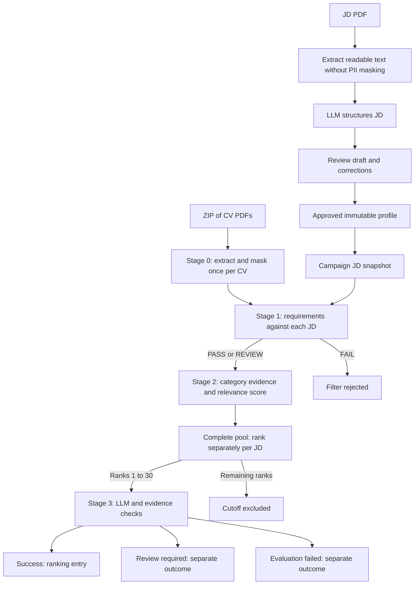

# RESULTS_ANALYSIS_WITH_ABH

Pipeline implementation and campaign results audit, 2026-09-26.

**Conclusion:** The campaign completed its processing, but it did not establish a reliable final hiring shortlist. The strongest confirmed problems are missing campaign experience facts, destructive masking of technical terms, unsupported project headings, sparse queries that usually return nothing, and Stage 2 scores that collapse three of four categories to zero. Review policy and limited evidence then keep most LLM assessments out of the ranking.

**Scope:** JD intake, PDF extraction and masking, candidate facts and requirements, retrieval and candidate selection, LLM assessment, persistence of pipeline outputs, and result interpretation. Auth/RBAC, web UI, Celery broker configuration, and system monitoring are excluded. Worker functions and campaign coordination are inspected only for domain data flow, selection, retries, and terminal outcomes.

**Evidence standard:** Source describes the implementation inspected now; saved campaign snapshots describe this run. A local replay or database probe is labelled separately. Confidence scores are engineering judgments about the stated mechanism, not statistical probabilities or estimates of how much accuracy a fix will recover. No production logic was changed and no new provider inference was requested for this audit.

## 1. Core Pipeline Execution & Contract Reference

### 1.1 Sources and execution branches

The measured campaign is `c2f3123a-ebec-4e69-a26b-ad123c82fb98`. Inputs were `CV_1000.zip` and `JD01.pdf` through `JD04.pdf` from `C:/Abhyudit_Files/Infinite/CV-Benchmark-Dataset-Generator/output/`.

| Evidence | Purpose |
|---|---|
| [full-campaign.json](artifacts/phase6/full-campaign.json) | Final completion, stage milestones, counts, ranking checks |
| [database-final-verification.json](artifacts/phase6/database-final-verification.json) | Independent final database accounting, exact top-30 checks, reviews and failures |
| [full-campaign.rankings.json](artifacts/phase6/full-campaign.rankings.json) | Eight ranked outputs, category scores, earlier verification requirements |
| [explain-run-pairs.json](artifacts/phase6/explain-run-pairs.json) | Read-only export of all 4,000 stage decisions, ranks, attempts, and outcomes |
| [abh-pipeline-diagnostics.json](artifacts/phase6/abh-pipeline-diagnostics.json) | New read-only query parsing, category-zero counts, evidence metadata, and selected review descriptions |
| [abh_pipeline_probe.py](artifacts/phase6/abh_pipeline_probe.py) | Reproducible read-only probe; it calls no provider and changes no DB records |
| [explained-selected-candidates.csv](artifacts/phase6/explained-selected-candidates.csv) | All 120 selected comparisons against benchmark expectations |
| [explained-ground-truth-comparison.json](artifacts/phase6/explained-ground-truth-comparison.json) | Expected Stage 1 decisions and relevance-band comparison |
| [PHASE6_CAPACITY_REPORT.md](PHASE6_CAPACITY_REPORT.md) | Earlier run history and fixes; its RUNNING status and provider totals are not final |
| `full-worker-events.jsonl`, `full-evaluation-tuned-events.jsonl`, provider resume JSONs | Recorded stage/provider events and recovery history; capture windows are incomplete |

Ground truth is the generator's `ground_truth.json`, supported by `candidates.json` and `validation.json`. These labels were not screening inputs. They are an independent, synthetic reference with different policy assumptions, not a verified real-world hiring judgment.

**Two candidate execution paths exist.** The measured ZIP campaign uses `execute_campaign_stage0`, `execute_campaign_pair`, and `execute_campaign_stage3` in [app/workers/tasks.py](app/workers/tasks.py). The single-run/text API uses [app/orchestrator.py](app/orchestrator.py), which accepts candidate attributes and recruiter overrides. Do not assume the campaign accepts or uses those facts just because the single-run schema contains them.



### 1.2 JD intake: upload to immutable comparison profile

Source: [app/api/jds.py](app/api/jds.py), [app/jd_intake.py](app/jd_intake.py), [app/api/schemas.py](app/api/schemas.py), [app/models/database.py](app/models/database.py).

| Step | Input | Transformation/output | Persistence or downstream use |
|---|---|---|---|
| Upload | Raw PDF bytes, `Content-Type: application/pdf`, `POST /api/v1/jds/extract` | Size bound, SHA-256 content hash, new/reused draft | `jd_drafts.pdf_hash`, status `PROCESSING`, provenance |
| Text extraction | PDF bytes | `ingest_pdf(..., redact=False)`; blocks, page numbers, OCR markers, joined text | Draft `pages`; despite its name, `redacted_text` holds unmasked JD text in this branch |
| LLM structuring | Up to 60,000 extracted characters inside `<job_description>`; system extraction prompt; strict provider schema | Parsed JSON validated as `ExtractedJD`; temperature 0; completion cap 8,192 | Draft `profile`; status `REVIEW`, or `FAILED` and extraction/provider error code |
| Recruiter approval | Full corrected `ExtractedJD` payload submitted to `/drafts/{id}/approve` | Validate corrected requirements; build `screening_profile(new_id)` | `approved_jds.profile`, provenance, approval time; draft becomes `APPROVED` |
| Campaign snapshot | Approved ID and profile | Copy approved profile and policy into campaign JD | `campaign_jds.job_snapshot`, `policy_snapshot`, `jd_key`, `stage3_cap=30` |

The raw extraction response envelope is `{draft_id, status, pages, profile, error_code, expires_at, provenance}`. The artifact adds `{input, method, http_status, seconds, output}` around it. Page blocks are `{block_number, text, bbox}` with page-level `{page_number, ocr_used, blocks}`.

Provider transport is a different envelope. Groq/OpenRouter JD requests contain `model`, `messages` (system extraction instructions and user JD text), `temperature: 0`, `max_tokens: 8192`, and `response_format: {type: "json_schema", json_schema: {name: "jd_profile", strict: true, schema: ...}}`. OpenRouter additionally requires supported parameters. The adapter reads `choices[0].message.content` from the provider JSON, removes optional JSON code fences, parses it, and returns the content object for Pydantic validation. Gemini instead supplies `system_instruction`, `response_mime_type`, and `response_json_schema`, then parses `response.text`. Neither the full transport envelope nor the untouched returned content is a persisted JD contract.

Drafts expire after seven days unless approved. Approval clears temporary `draft.pages`, retains the corrected draft profile, and creates a separate approved profile. Reapproval with a different comparison profile returns a conflict: the supported API does not edit an approved version. This is application-level immutability, not a database trigger preventing arbitrary SQL updates.

`ExtractedJD` forbids extra fields and includes:

| Field | Contract |
|---|---|
| `schema_version` | Literal `jd-v1` |
| `title` | Nonblank string, maximum 255 characters |
| `must_have_skills`, `nice_to_have_skills` | Up to 100 `SkillCluster` objects each |
| Skill cluster | `canonical`, `aliases`, `substitutes`; one alternative group is represented as one cluster |
| `hard_filter_rules` | Minimum years, optional degree requirement, authorization requirement; JD authorization defaults false |
| `jd_category_queries` | Exactly `SKILLS`, `EXPERIENCE`, `PROJECTS`, `EDUCATION`; nonblank strings up to 4,000 characters |
| `uncertainties` | Up to 100 nonblank notes, each at most 2,000 characters |

The provider schema is derived from Pydantic, then recursively removes defaults, requires every declared property, and forbids extra object properties. Local Pydantic validation still has defaults, so provider strictness and local acceptance are not identical. `screening_profile()` removes `schema_version` and `uncertainties`, adds `job_id`, and validates `JobProfileInputSchema`. Uncertainty notes stay in approval provenance, not the screening prompt.

**Exact provider-facing JD JSON schema, generated from inspected source:**

```json
{
  "$defs": {
    "DegreeRequirement": {
      "additionalProperties": false,
      "properties": {
        "level": {
          "title": "Level",
          "type": "string"
        },
        "level_aliases": {
          "items": {
            "minLength": 1,
            "type": "string"
          },
          "title": "Level Aliases",
          "type": "array"
        },
        "fields": {
          "items": {
            "minLength": 1,
            "type": "string"
          },
          "title": "Fields",
          "type": "array"
        },
        "field_aliases": {
          "items": {
            "minLength": 1,
            "type": "string"
          },
          "title": "Field Aliases",
          "type": "array"
        }
      },
      "title": "DegreeRequirement",
      "type": "object",
      "required": [
        "level",
        "level_aliases",
        "fields",
        "field_aliases"
      ]
    },
    "JDHardFilters": {
      "additionalProperties": false,
      "properties": {
        "min_years_experience": {
          "ge": 0,
          "title": "Min Years Experience",
          "type": "number"
        },
        "degree_requirement": {
          "anyOf": [
            {
              "$ref": "#/$defs/DegreeRequirement"
            },
            {
              "type": "null"
            }
          ]
        },
        "require_work_authorization": {
          "title": "Require Work Authorization",
          "type": "boolean"
        }
      },
      "title": "JDHardFilters",
      "type": "object",
      "required": [
        "min_years_experience",
        "degree_requirement",
        "require_work_authorization"
      ]
    },
    "SkillCluster": {
      "additionalProperties": false,
      "properties": {
        "canonical": {
          "description": "The primary name of the required skill/technology (e.g., 'Kubernetes').",
          "maxLength": 120,
          "minLength": 1,
          "pattern": "\\S",
          "title": "Canonical",
          "type": "string"
        },
        "aliases": {
          "description": "Exact acronyms, synonyms, or alternative spellings (e.g., ['k8s', 'kubectl']).",
          "items": {
            "maxLength": 120,
            "minLength": 1,
            "pattern": "\\S",
            "type": "string"
          },
          "maxItems": 30,
          "title": "Aliases",
          "type": "array"
        },
        "substitutes": {
          "description": "Acceptable domain substitutes scored at partial weight (e.g., ['docker swarm']).",
          "items": {
            "maxLength": 120,
            "minLength": 1,
            "pattern": "\\S",
            "type": "string"
          },
          "maxItems": 30,
          "title": "Substitutes",
          "type": "array"
        }
      },
      "required": [
        "canonical",
        "aliases",
        "substitutes"
      ],
      "title": "SkillCluster",
      "type": "object"
    }
  },
  "additionalProperties": false,
  "properties": {
    "schema_version": {
      "const": "jd-v1",
      "title": "Schema Version",
      "type": "string"
    },
    "title": {
      "maxLength": 255,
      "minLength": 1,
      "pattern": "\\S",
      "title": "Title",
      "type": "string"
    },
    "must_have_skills": {
      "items": {
        "$ref": "#/$defs/SkillCluster"
      },
      "maxItems": 100,
      "title": "Must Have Skills",
      "type": "array"
    },
    "nice_to_have_skills": {
      "items": {
        "$ref": "#/$defs/SkillCluster"
      },
      "maxItems": 100,
      "title": "Nice To Have Skills",
      "type": "array"
    },
    "hard_filter_rules": {
      "$ref": "#/$defs/JDHardFilters"
    },
    "jd_category_queries": {
      "type": "object",
      "additionalProperties": false,
      "properties": {
        "SKILLS": {
          "type": "string",
          "minLength": 1,
          "maxLength": 4000
        },
        "EXPERIENCE": {
          "type": "string",
          "minLength": 1,
          "maxLength": 4000
        },
        "PROJECTS": {
          "type": "string",
          "minLength": 1,
          "maxLength": 4000
        },
        "EDUCATION": {
          "type": "string",
          "minLength": 1,
          "maxLength": 4000
        }
      },
      "required": [
        "SKILLS",
        "EXPERIENCE",
        "PROJECTS",
        "EDUCATION"
      ]
    },
    "uncertainties": {
      "items": {
        "type": "string"
      },
      "maxItems": 100,
      "title": "Uncertainties",
      "type": "array"
    }
  },
  "required": [
    "schema_version",
    "title",
    "must_have_skills",
    "nice_to_have_skills",
    "hard_filter_rules",
    "jd_category_queries",
    "uncertainties"
  ],
  "title": "ExtractedJD",
  "type": "object"
}
```

**What was actually saved:** Parsed and validated profiles, not the untouched provider response body. `jdNN-extraction.json -> output.profile` is the initial structured result; `jdNN-approval.json -> input` is the correction submission; `output.profile` is the final downstream profile. JSON whitespace, original raw response text, and malformed provider output cannot be reconstructed from these files.

| JD | Role / minimum years | Initial extraction | Final profile actually used |
|---|---|---|---|
| JD01 | Java Backend / 3 | [jd01-extraction.json](artifacts/phase6/jd01-extraction.json) | [jd01-approval.json](artifacts/phase6/jd01-approval.json), `output.profile` |
| JD02 | C#/.NET Backend / 3 | [jd02-extraction.json](artifacts/phase6/jd02-extraction.json) | [jd02-approval.json](artifacts/phase6/jd02-approval.json), `output.profile` |
| JD03 | QA Automation / 2 | [jd03-extraction.json](artifacts/phase6/jd03-extraction.json) | [jd03-approval.json](artifacts/phase6/jd03-approval.json), `output.profile` |
| JD04 | Data Engineering / 3 | [jd04-extraction.json](artifacts/phase6/jd04-extraction.json) | [jd04-approval.json](artifacts/phase6/jd04-approval.json), `output.profile` |

Approved IDs, respectively: `d89c10d5f4c84639a46000c04324d301`, `a038c776c96041c49e171040fdf8fd1a`, `cefbdecad0d84d969d6747a6846371fe`, `42a7509a9ecd4fc3876a6367e93225fc`.

Approved required groups:

| JD | Required groups; slash means an approved alternative |
|---|---|
| JD01 | Java; Spring Boot; REST APIs; SQL / PostgreSQL |
| JD02 | C#; .NET / ASP.NET Core; Web API; SQL Server / Entity Framework |
| JD03 | Selenium / Playwright / Cypress; API Testing / Postman; SQL; JUnit / TestNG / Python / Java |
| JD04 | Python; SQL; Apache Spark / PySpark; Airflow / ETL |

JD01 originally split SQL and PostgreSQL into two mandatory items. JD02 originally put `or` alternatives inside canonical names. Both were corrected at approval. JD03/04 required groups were unchanged. No degree or authorization hard filter was enabled. Natural spelling variants such as `REST API` and `RESTful APIs` are not automatically accepted by the exact Stage 1 matcher unless explicitly listed; approved alternatives and lexical aliases currently share the same field.

### 1.3 Stage 0: extraction, OCR, masking, and handoff

Source: [pipeline.py](app/stage0_extraction/pipeline.py), [integrity.py](app/stage0_extraction/integrity.py), [parser.py](app/stage0_extraction/parser.py), [pii_masker.py](app/stage0_extraction/pii_masker.py).

1. Reject bytes without `%PDF-`, oversized/malformed/password-protected PDFs, unsupported page counts/dimensions, and excessive blocks/text.
2. Extract PyMuPDF text blocks and arrange approximate reading order using full-width dividers and left/right columns.
3. Assess each page's case-folded text: entropy must be 3.5–5.0; require at least four words and 25 alphabetic characters, and decoding/control artifacts at most 1%. The old 70% dictionary-density requirement is disabled for this ingestion path.
4. If unreadable, rasterize at a bounded scale and call Tesseract English OCR. Recheck OCR text quality. OCR output becomes one page-sized block, reducing layout precision.
5. Mask CV blocks, preserve page/block locations, and join masked text. JD intake skips masking.

Source defaults: 10 MiB/file, 20 pages, maximum page rectangle area 10,000,000; OCR bitmap maximum 4,000,000 pixels, up to five OCR pages, 15 seconds per OCR call. At most 2,000 extracted blocks/page, 200,000 text characters/page, 500,000/document. Campaign snapshots confirm the file/page/OCR count defaults; not every runtime setting is frozen in the snapshot.

**Masking engines and behavior:**

| Target | Implementation | Limitation relevant to screening |
|---|---|---|
| Email | Regex for conventional address form and 2–7 character suffix | Not a universal email grammar |
| Phone, including extensions | Nepal/international numeric regex; optional `x`, `ext`, `extension` digits | Broad numeric patterns can collide with non-contact numbers; complete first-page lines are removed if matched |
| First-page contact lines | Entire line replaced with `[REDACTED_CONTACT]` when email/phone matches | Can remove nearby useful text on a mixed-purpose line |
| First-page name / repeated name | Short alphabetic first-block first line treated as candidate name; replace same phrase on later blocks/pages | A heuristic rather than verified name recognition |
| Header names | spaCy `en_core_web_sm`, `PERSON` -> `[REDACTED_NAME]` | No technical whitelist applied in header |
| Header locations/address | Nepal geographic regex plus spaCy `GPE`, `LOC`, `FAC` -> location placeholder | No general standalone address parser; complete contact-line masking covers some unknown addresses |
| Body names | spaCy `PERSON`, except entities containing one of a small technology whitelist | Whitelist lacks Java and many other terms; false positives can erase skills |
| Body locations | Generally retained | Header/body classification directly changes what survives |
| Older graduation years | Education-context regex masks 19xx and 2000–2019 as `[PREVIOUS_ERA_YEAR]` | Creates model-visible missing information, though graduation year is not mandatory here |

The campaign PDF path stays in header mode until an exact recognized line such as `SUMMARY`, `EXPERIENCE`, `SKILLS`, `TECHNICAL SKILLS`, `EDUCATION`, or `PROJECTS`. It does **not** switch at `PROFILE` or `PROFESSIONAL EXPERIENCE`. The chunker has a larger heading vocabulary. Consequently, summaries can receive aggressive header masking even though the chunker later treats them as experience evidence. The text API instead splits its header with a different regex or the first 400 characters; the two entry paths do not mask identically.

**Actual intermediate contract:** `PDFIngestionResult` is a dataclass, not a Pydantic schema. It contains `status`, `code`, `pages`, `redacted_text`:

```json
{
  "status": "success",
  "code": "OK",
  "redacted_text": "[REDACTED_NAME]\n\nTECHNICAL SKILLS\n\nJava | SQL",
  "pages": [{
    "page_number": 1,
    "ocr_used": false,
    "blocks": [{"block_number": 0, "text": "[REDACTED_NAME]", "bbox": [42, 40, 220, 67]}]
  }]
}
```

This is an illustrative shape, not an actual saved CV. `finish_stage0()` persists text/pages in `campaign_cvs.redacted_text/source_locations`, marks `SUCCEEDED`, and purges `encrypted_pdf` on either success or failure. The database enforces no raw PDF for terminal Stage 0 records. Ingestion can return lowercase `review` for OCR uncertainty, but the campaign maps any non-success result to Stage 0 `FAILED` and pair `EXTRACTION_FAILED`; it has no separate Stage 0 review outcome. No such uncertainty occurred in this final batch.

Stage 1 receives the stored masked text, the job snapshot, and explicitly unknown experience/authorization facts. It does not receive a rich parsed candidate profile from Stage 0.

### 1.4 Stage 1: deterministic checks and precise status vocabulary

Source: [contracts.py](app/stage1_rules/contracts.py), [rules_engine.py](app/stage1_rules/rules_engine.py), [jd_matcher.py](app/stage1_rules/jd_matcher.py).

**Vocabulary correction:** The rule engine emits `PASS`, `FAIL`, or **`REVIEW`**, not `REVIEW_REQUIRED`. `REVIEW_REQUIRED` is the Stage 3 terminal assessment status. Pipeline metrics use `stage1_review_required` as a counter label, which should not be mistaken for the stored decision value.

The reusable candidate input supports `candidate_id`, `raw_cv_text`, authorization and source, parsed attributes, and recruiter overrides. Sources are `recruiter_verified`, `cv_extracted`, `unknown`. Authorization is `eligible`, `ineligible`, `unknown`; legacy actual booleans normalize, but string booleans do not. Experience must be a finite, nonnegative numeric value, not a string or boolean. Overrides take precedence over reported facts. Degree metadata alone is not used as verified education evidence.

**Exact reusable candidate input schema:** This belongs to the single-run/text path; the ZIP campaign does not construct this object.

```json
{
  "$defs": {
    "AttributeSource": {
      "enum": [
        "recruiter_verified",
        "cv_extracted",
        "unknown"
      ],
      "title": "AttributeSource",
      "type": "string"
    },
    "AuthorizationStatus": {
      "enum": [
        "eligible",
        "ineligible",
        "unknown"
      ],
      "title": "AuthorizationStatus",
      "type": "string"
    },
    "CandidateAttributes": {
      "additionalProperties": false,
      "properties": {
        "experience_years": {
          "anyOf": [
            {
              "ge": 0,
              "type": "number"
            },
            {
              "type": "null"
            }
          ],
          "default": null,
          "title": "Experience Years"
        },
        "experience_source": {
          "$ref": "#/$defs/AttributeSource",
          "default": "unknown"
        },
        "work_authorized": {
          "$ref": "#/$defs/AuthorizationStatus",
          "default": "unknown"
        },
        "authorization_source": {
          "$ref": "#/$defs/AttributeSource",
          "default": "unknown"
        },
        "degree": {
          "anyOf": [
            {
              "type": "string"
            },
            {
              "type": "null"
            }
          ],
          "default": null,
          "description": "Legacy metadata only; education is evaluated from CV evidence",
          "title": "Degree"
        }
      },
      "title": "CandidateAttributes",
      "type": "object"
    },
    "RecruiterOverrides": {
      "additionalProperties": false,
      "properties": {
        "experience_years": {
          "anyOf": [
            {
              "ge": 0,
              "type": "number"
            },
            {
              "type": "null"
            }
          ],
          "default": null,
          "title": "Experience Years"
        },
        "work_authorized": {
          "anyOf": [
            {
              "$ref": "#/$defs/AuthorizationStatus"
            },
            {
              "type": "null"
            }
          ],
          "default": null
        }
      },
      "title": "RecruiterOverrides",
      "type": "object"
    }
  },
  "additionalProperties": false,
  "properties": {
    "candidate_id": {
      "minLength": 1,
      "title": "Candidate Id",
      "type": "string"
    },
    "raw_cv_text": {
      "title": "Raw Cv Text",
      "type": "string"
    },
    "work_authorized": {
      "$ref": "#/$defs/AuthorizationStatus",
      "default": "unknown"
    },
    "authorization_source": {
      "$ref": "#/$defs/AttributeSource",
      "default": "unknown"
    },
    "parsed_attributes": {
      "$ref": "#/$defs/CandidateAttributes"
    },
    "recruiter_overrides": {
      "$ref": "#/$defs/RecruiterOverrides"
    }
  },
  "required": [
    "candidate_id",
    "raw_cv_text"
  ],
  "title": "CandidateInput",
  "type": "object"
}
```

Actual campaign rule call, reduced to domain arguments:

```python
evaluate_stage1_hard_filters(
    candidate_yoe=None,
    candidate_cv_text=stored_redacted_text,
    work_authorized=AuthorizationStatus.UNKNOWN,
    jd_profile=resolve_hard_filters(stored_job_snapshot),
    experience_source=AttributeSource.UNKNOWN,
    authorization_source=AttributeSource.UNKNOWN,
    required_skills=stored_job_snapshot.get("must_have_skills", []),
)
```

| Check | PASS | REVIEW | FAIL |
|---|---|---|---|
| Authorization | Not required, or verified eligible | Unknown, or known but unverified | Verified ineligible |
| Experience | Minimum is zero, or verified years meet minimum | Unknown years, or years from a source other than recruiter verification | Verified years below minimum |
| Required skill group | Positive canonical/alias/substitute mention | Missing or negated mention | No skill-based FAIL is implemented |
| Degree, when enabled | Completed degree meets level/field | Missing, ambiguous, in-progress, or uncertain field | Explicit inadequate level or documented field mismatch |

Skill matching uses case-insensitive escaped text with `(?<!\w)` and `(?!\w)` boundaries. Canonical and aliases score 1.0; approved substitutes score 0.75. Negation checks the preceding sentence/line fragment up to 80 characters for `no`, `not`, `without`, `lack`, `lacking`, `never`. This is mention evidence, not proof of proficiency. Punctuation/spelling variations are not expanded automatically.

Rule output is an untyped dictionary with `status`, policy version `stage1-v1.1.0`, checks, failed reasons, review notes, and metrics. Campaign processing adds provenance and copies review checks to `verification_reasons`.

```json
{
  "status": "REVIEW",
  "policy_version": "stage1-v1.1.0",
  "checks": [
    {"rule": "authorization", "status": "PASS", "code": "AUTHORIZATION_NOT_REQUIRED", "message": "JD does not require an authorization filter."},
    {"rule": "experience", "status": "REVIEW", "code": "EXPERIENCE_UNKNOWN", "message": "Years of experience are unknown."}
  ],
  "failed_reasons": [],
  "review_notes": ["Years of experience are unknown."],
  "metrics": {"candidate_yoe": null, "min_required_yoe": 3.0, "experience_source": "unknown"},
  "input_provenance": {"reported_experience_source": "unknown", "reported_authorization_source": "unknown", "document_version": 1}
}
```

The example omits additional education/skill checks and metrics for readability. Final decision precedence is any FAIL -> FAIL; otherwise any REVIEW -> REVIEW; otherwise PASS. Both PASS and REVIEW enter retrieval. FAIL becomes pair `FILTER_REJECTED`.

The separate `match_cv_against_jds()` helper with a default 50% anchor threshold is **not** the measured campaign's Stage 1 gate. ZIP intake creates every CV–JD combination.

### 1.5 Stage 2: chunks, hybrid retrieval, reranking, and cutoff

Source: [chunker.py](app/stage2_retrieval/chunker.py), [repository.py](app/stage2_retrieval/repository.py), [hybrid_search.py](app/stage2_retrieval/hybrid_search.py), [embeddings.py](app/stage2_retrieval/embeddings.py), [reranker.py](app/stage2_retrieval/reranker.py), [evidence_extractor.py](app/stage2_retrieval/evidence_extractor.py), [coordinator.py](app/campaigns/coordinator.py).

**Chunk construction:** Structural headings map `SUMMARY` to `EXPERIENCE`, certifications to `EDUCATION`, and other recognized headings to their own category. Unheaded text defaults to experience. Chunk prefix is `[Section: SECTION] `. Target minimum is 150 characters and maximum including prefix is 600; short fragments can remain. With source pages, each PDF block is chunked separately, so the minimum is not a guarantee that neighboring blocks will be merged. A date line can become its own snippet. Page number, block index, bounding box, section, and chunk index survive.

`SELECTED PROJECTS`, the heading used by locally replayed benchmark CVs, is absent from the recognized project aliases. `Projects` and `Key Projects` are recognized; `Selected projects` is not. This difference changes category assignment.

**Storage/cache identity:** Redacted document identity depends on candidate, source text/pages hash, `pii-mask-v4`, and `structural-v2`. Chunk identity depends on document identity, global position, and text. Chunk embeddings are cached against embedding model/version; query vectors against job ID, category, query hash, model/version. IDs indicate persisted source identity, not an accuracy guarantee. Model loading permits environment path overrides; version strings in the code/cache do not themselves verify the bytes of an overridden model directory.

**Dense retrieval:** `all-MiniLM-L6-v2`, 384 dimensions. PostgreSQL orders `e.vector <=> query_vector`, i.e. cosine distance; smaller is better. The memory implementation computes cosine similarity directly; larger is better. Search is scoped to one candidate, one document version, and one category. It does not retrieve passages from other candidates. Top 10 per branch.

**Sparse retrieval — no BM25 is implemented.** The PostgreSQL campaign uses generated `to_tsvector('english', text)`, `websearch_to_tsquery('english', category_query)`, and descending `ts_rank_cd`. See [retrieval migration](alembic/versions/c4b8e6a2f901_stage2_postgres_retrieval.py). The in-memory alternative counts exact query-word occurrences and discards terms at most two characters long. Neither is BM25; there are no implemented BM25 `k1`/`b` constants to report.

Sparse query construction passes the entire JD category string unchanged to `websearch_to_tsquery`. Ordinary separated words tend to become AND requirements, while the word `or` changes Boolean structure. For example:

```text
Java, Spring Boot, REST APIs, SQL, PostgreSQL, Kafka, Docker, Kubernetes, JUnit
=> 'java' & 'spring' & 'boot' & 'rest' & 'api' & 'sql' & 'postgresql'
   & 'kafka' & 'docker' & 'kubernet' & 'junit'
```

This requires all terms in one skills chunk, including preferred skills. Approved mandatory alternatives are not compiled into explicit lexical groups. In .NET queries, English tokenization turns `C#` into `c`, and plain-text `or` creates disjunctions across the surrounding expression; this is not a faithful structured requirement evaluator.

If SKILLS or PROJECTS chunks do not exist, database `category_metadata` (`category-v1`) permits fallback to EXPERIENCE. There is no education fallback. The result retains its source category; Stage 3 may cite it in the requested category if it is the allowed skills/projects fallback.

**RRF (reciprocal rank fusion):**

\[
\operatorname{RRF}(c)=\sum_{b\in\{dense,sparse\},\ c\in b}\frac{1}{60+\operatorname{rank}_b(c)}.
\]

Ranks start at 1, `k=60`, missing branches contribute zero. A first hit in one branch scores `1/61`; first in both scores `2/61`. Fuse by chunk ID, round to six decimals, take top 10. RRF merges rank positions, not the raw scores. If sparse hits are empty, fusion is effectively dense ordering.

**Cross-encoder:** `cross-encoder/ms-marco-MiniLM-L-6-v2`; each input pair is `[category_query, chunk.text]`, where the text already contains the section prefix. It predicts a scalar for each of the fused hits; scores are rounded to four decimals, sorted descending, and only top two passages/category reach Stage 3.

**Actual scoring normalization:** No sigmoid, percentile calibration, min–max normalization, or suitability scale is applied. For category C:

\[
A_C=\max\left(0,\frac{1}{n_C}\sum_{i=1}^{n_C}r_i\right),\quad n_C\le2;
\qquad A_C=0\text{ when no snippets exist}.
\]

\[
S_2=0.40A_{EXPERIENCE}+0.30A_{SKILLS}+0.15A_{PROJECTS}+0.15A_{EDUCATION}.
\]

These are raw reranker scores clamped after averaging, not a probability or a percentage. Negative averages collapse to zero, including distinctions between different negative scores. A positive and a strongly negative selected passage can also average to zero.

Stage 2 output shape is `{candidate_id, composite_score, category_scores, evidence_by_category, status}`. Evidence arrays contain `chunk_id`, `document_id`, candidate/source category/section/index, masked `text`, `source_location`, `rrf_score`, `dense_rank`, `sparse_rank`, `rerank_score`. This boundary is a dictionary; worker code checks candidate identity, SUCCESS status, and a finite numeric score. It is not validated as a dedicated Pydantic Stage 2 model.

**Global cutoff means global within one JD.** The coordinator waits for that JD's whole pool to finish Stage 1/2, ranks eligible pairs by Stage 2 score descending then candidate UUID ascending, stores ranks, marks 1–30 SHORTLISTED, and marks others CUTOFF_EXCLUDED. Ties are deterministic but the candidate UUID adds no suitability information. No minimum positive score is required and unused slots are not refilled after Stage 3 review/failure. The campaign cutoff is 30; the older `rank_and_filter_candidate_batch()` helper default of 40 does not control this run.

### 1.6 Stage 3: context, output schema, evidence checks, terminal status

Source: [prompts.py](app/stage3_evaluation/prompts.py), [schemas.py](app/stage3_evaluation/schemas.py), [evidence.py](app/stage3_evaluation/evidence.py), [llm_client.py](app/stage3_evaluation/llm_client.py), [scoring.py](app/stage3_evaluation/scoring.py).

`build_evidence_registry()` first verifies candidate ownership, allowed categories/fallbacks, stable chunk identity, and valid source-location shape. It assigns trusted tags such as `SKILLS:1`, `EXPERIENCE:2`. Empty snippets are not citable. Registry entries include candidate ID, requested/source category, chunk/document IDs, source location, and masked text.

The XML prompt contains:

- Candidate ID and JD title.
- Mandatory/preferred skill groups with canonical, aliases, substitutes.
- Four category requirement strings.
- Up to two masked snippets/category labelled with registry tags; missing categories use `tag="NONE"` placeholders.

The prompt does not include the whole CV, full original JD, Stage 1 review checks, or a separate structured `hard_filter_rules` object. Experience minimum appears only because the category requirement text contains it. The complete citation map stays in Python; the model sees tags and text, not page/block IDs. XML serialization escapes evidence so it cannot close real snippet elements.

The system prompt requires evidence-only assessment, same-category score citations, experience citations for career gaps, independent category scores, and missing information as neutral uncertainty. It specifically mentions unstated graduation years and unlisted project details as missing information, even when the JD does not make them mandatory. This interacts with automatic review routing.

**Exact LLM output JSON schema from Pydantic:** All six top-level fields are required. Scores must be finite and in 0–100. Extra fields are forbidden; citation validity is checked later, not by the string-list schema.

```json
{
  "$defs": {
    "CategoryAssessment": {
      "additionalProperties": false,
      "properties": {
        "score": {
          "maximum": 100.0,
          "minimum": 0.0,
          "title": "Score",
          "type": "number"
        },
        "rationale": {
          "title": "Rationale",
          "type": "string"
        },
        "citations": {
          "items": {
            "type": "string"
          },
          "title": "Citations",
          "type": "array"
        }
      },
      "required": [
        "score",
        "rationale",
        "citations"
      ],
      "title": "CategoryAssessment",
      "type": "object"
    },
    "FlagDetail": {
      "additionalProperties": false,
      "properties": {
        "type": {
          "$ref": "#/$defs/FlagType"
        },
        "severity": {
          "$ref": "#/$defs/Severity"
        },
        "description": {
          "title": "Description",
          "type": "string"
        },
        "citations": {
          "items": {
            "type": "string"
          },
          "title": "Citations",
          "type": "array"
        }
      },
      "required": [
        "type",
        "severity",
        "description",
        "citations"
      ],
      "title": "FlagDetail",
      "type": "object"
    },
    "FlagType": {
      "enum": [
        "DOCUMENTED_INCONSISTENCY",
        "EVIDENCED_CAREER_GAP",
        "MISSING_INFORMATION"
      ],
      "title": "FlagType",
      "type": "string"
    },
    "Severity": {
      "enum": [
        "LOW",
        "MEDIUM",
        "HIGH",
        "CRITICAL"
      ],
      "title": "Severity",
      "type": "string"
    }
  },
  "additionalProperties": false,
  "properties": {
    "skills": {
      "$ref": "#/$defs/CategoryAssessment"
    },
    "experience": {
      "$ref": "#/$defs/CategoryAssessment"
    },
    "projects": {
      "$ref": "#/$defs/CategoryAssessment"
    },
    "education": {
      "$ref": "#/$defs/CategoryAssessment"
    },
    "flags": {
      "items": {
        "$ref": "#/$defs/FlagDetail"
      },
      "title": "Flags",
      "type": "array"
    },
    "executive_summary": {
      "title": "Executive Summary",
      "type": "string"
    }
  },
  "required": [
    "skills",
    "experience",
    "projects",
    "education",
    "flags",
    "executive_summary"
  ],
  "title": "LLMEvaluationOutput",
  "type": "object"
}
```

There is no model-generated citation map field. The schema contains category `rationale` strings and citation-tag lists; `flags` are typed descriptions with severity and citations. Reasoning means these supplied rationale fields, not a separately stored chain of thought. `llm_raw_output` in persisted evaluations means this validated model object, **not** the untouched provider response body.

Verification checks each citation's format, existence in the trusted registry, and allowed requested category. It adds missing-evidence, missing-citation, wrong/invalid-citation, and injection review reasons. A reference that exists is not proof that its text supports the claim or score: semantic entailment is not checked. A date-only passage can therefore pass citation membership validation without supporting a detailed experience assessment.

Python computes:

\[
S_3=0.40\,skills+0.30\,experience+0.20\,projects+0.10\,education.
\]

Use Decimal and ROUND_HALF_UP to two decimals. Tier 1 is at least 75; Tier 2 is 55–below 75; Tier 3 is below 55. These weights differ deliberately from Stage 2. A missing-information flag does not directly subtract points, but it always creates `MISSING_INFORMATION` and prevents SUCCESS.

| Terminal assessment | Assignment | Score/tier |
|---|---|---|
| `SUCCESS` | Valid output, evidence verification with no review reasons, no missing-information or high/critical flags requiring review | Four category scores, composite, final tier |
| `REVIEW_REQUIRED` | Valid output with any verification review reason, any missing-information flag, or a high/critical non-missing flag | Composite/category scores retained, tier null |
| `EVALUATION_FAILED` | Invalid evidence/output, provider error, or exhausted retry allowance | No suitability score/tier; stable execution error code |

Final Pydantic object fields: `candidate_id`, `evaluation_status`, `scoring_policy_version`, `composite_score`, `tier`, `category_scores`, `llm_raw_output`, `verified_citations`, `invalid_citations`, `has_critical_flags`, `review_reasons`, `error_code`, `error_message`, `evidence_verification`, `is_mock`. Validator rules require exactly four categories and evidence verification for assessments; failed outcomes cannot fabricate category scores or candidate judgments. Registry/checks/source-location structures are also Pydantic models.

Campaign code uses `max_retries=0` and one provider attempt per assessment call. Malformed output becomes a terminal failure without a structured-output repair retry. Rate limits and selected temporary service/timeout failures are instead persisted and retried up to five counted attempts. Admission delays do not increment inference attempts. Interrupted calls, provider switching, and retries mean attempts are not identical to returned model assessments.

The current ranking API includes only pair SUCCESS, sorted composite descending then candidate UUID. Earlier Stage 1 uncertainty remains in `verification_required` and `provisional`; it does not change Stage 3 SUCCESS into REVIEW_REQUIRED. Thus a successful assessment can still be a provisional candidate with unresolved requirements. Review outcomes are exposed separately and ordered by Stage 2 rank, not as a final suitability leaderboard.

### 1.7 Pipeline persistence reference

| Table | Key data / downstream meaning |
|---|---|
| `jd_drafts` | Temporary extraction pages, parsed/corrected profile, status/error, PDF hash, extraction provenance |
| `approved_jds` | Final approved profile and review provenance; one approved record per draft |
| `campaigns` | Intake/completion state and accepted archive report; COMPLETED means all comparisons terminal |
| `campaign_jds` | Approved `jd_key`, frozen job/policy snapshots, cap, per-job completion state |
| `campaign_cvs` | Source filename, candidate ID, document version, Stage 0 state, masked text/pages; transient encrypted PDF purged |
| `campaign_pairs` | One CV–JD comparison; Stage 1 decision/details, Stage 2 score/rank, Stage 3 status/score/tier, verification flags, failure code, attempts, result snapshot |
| `candidates`, `document_versions` | Retrieval identity and redaction/chunking versions |
| `source_chunks` | Category, source section/location, masked text, hash; generated PostgreSQL `tsv_content` is added by migration rather than declared in ORM |
| `chunk_embeddings`, `job_query_embeddings` | 384-dimensional vectors and model/query cache identities |
| `category_metadata` | Versioned skills/projects -> experience fallback policy |
| `screening_runs`, `candidate_outcomes`, legacy `job_profiles`/`evaluation_results` | Other single-run audit path; not the campaign result store |

Unique CV–JD pairs and composite foreign keys keep campaign comparisons separate. The final verification found zero legacy evaluation rows in the campaign window. Domain artifacts should be interpreted through campaign snapshots rather than the other path's tables.

## 2. Campaign Result Diagnostics & Root Cause Analysis

### 2.1 Final state, reconciliation, and qualifications

The final database state is COMPLETED: 4,000 terminal, unique comparisons, all four JDs COMPLETED. Database timestamps are 10:33:32–12:45:27 UTC on September 26; approximately 2h 11m 55s of database campaign time. The observer reported 7,917.344 seconds including its intake/poll boundary. These are close but not identical timing definitions.

| Stage | Input | Output / continued |
|---|---:|---|
| Intake | 1,000 PDFs | 1,000 accepted; zero rejected |
| Stage 0 | 1,000 CVs / 1,634 pages | 1,000 SUCCEEDED; 43 OCR pages in 30 scanned PDFs |
| Stage 1 | 4,000 comparisons | 4,000 REVIEW, zero PASS/FAIL; all continue |
| Stage 2 | 4,000 comparisons | 30 per JD selected, 3,880 cutoff exclusions |
| Stage 3 | 120 comparisons / 117 unique CVs | 8 SUCCESS, 97 REVIEW_REQUIRED, 15 EVALUATION_FAILED |

Stage 0 finished at about 814.75 seconds; all four shortlists were ready by about 1,491.453 seconds. Per-JD exact top-30, complete ranks 1–1,000, deterministic ordering, uniqueness, and final ranking checks passed. All 120 selected comparisons have at least one Stage 3 attempt. This proves they entered processing; it does not prove they all received a usable response. There are 114 persisted Stage 3 evaluation snapshots, including failure snapshots; all 105 success/review assessments have snapshots, while six retry-exhaustion outcomes have no assessment snapshot.

| JD | Selected | SUCCESS | Review | Failure |
|---|---:|---:|---:|---:|
| Java | 30 | 3 | 18 | 9 |
| .NET | 30 | 4 | 24 | 2 |
| QA | 30 | 1 | 25 | 4 |
| Data | 30 | 0 | 30 | 0 |

**Processing completion and model assessment coverage are different.** Only 6.7% of selected comparisons have Stage 3 SUCCESS, 80.8% require review, and 12.5% failed. All eight ranking entries remain provisional because of Stage 1 verification requirements. SUCCESS is not a recommendation to hire, and execution failure is not candidate rejection.

### 2.2 Independent expectation comparison

Generator Stage 1 expectations total PASS 323, FAIL 2,333, REVIEW 1,344. Actual decisions total REVIEW 4,000. These expected labels include known generator experience and skill facts, whereas current pipeline policy only permits certain verified facts to reject. The mismatch is therefore partly a product-policy mismatch and partly missing campaign fact extraction.

| JD | Expected PASS / FAIL / REVIEW | Strong matches available | Strong matches selected | Selected expected FAIL |
|---|---|---:|---:|---:|
| Java | 60 / 666 / 274 | 60 | 15 | 6 |
| .NET | 102 / 763 / 135 | 102 | 11 | 14 |
| QA | 91 / 351 / 558 | 91 | 14 | 5 |
| Data | 70 / 553 / 377 | 70 | 13 | 4 |

| JD | Selected benchmark bands |
|---|---|
| Java | 15 high, 11 moderate, 4 low |
| .NET | 11 high, 7 moderate, 12 unrelated |
| QA | 14 high, 15 moderate, 1 low |
| Data | 13 high, 16 moderate, 1 low |

The system sent its own exact top 30 to Stage 3, but these selections contained only 53 of 323 high-labelled comparisons across the four jobs (16.4%). With a fixed cap of 30, retrieving every high match is impossible; however, there were enough high matches to fill each list without low/unrelated choices. The current selected high-match share is 53/120, or 44.2%.

For a secondary comparison, the overlap with each benchmark top 30 sorted by relevance then filename is Java 4, .NET 1, QA 6, Data 2. Many benchmark scores tie, so this exact-membership statistic is tie-sensitive and is not the primary quality metric. High-band coverage and unrelated selections give clearer evidence.

### 2.3 Confirmed cause A: experience is absent and missing skills do not reject

**Confidence: 100% for why Stage 1 returned REVIEW for everyone.** Source hardcodes `candidate_yoe=None` and UNKNOWN provenance. All four jobs have positive experience minima. The database confirms 4,000 EXPERIENCE_UNKNOWN checks, 4,000 AUTHORIZATION_NOT_REQUIRED checks, and 4,000 EDUCATION_NOT_REQUIRED checks.

Skill checks recorded 5,767 REQUIRED_SKILL_FOUND and 10,233 REQUIRED_SKILL_UNCERTAIN across 16,000 group checks. Missing skills produce REVIEW, not FAIL. No hard degree/authorization filter was active, so no remaining enabled rule could reject these campaign candidates.

Even adding automatic experience extraction alone would not create hard rejections under current rules: `cv_extracted` experience remains unverified and gets REVIEW before a minimum-years rejection is considered. The product must define which facts permit automatic exclusion, rather than simply passing inferred years as recruiter verified.

**Effect:** All candidates consume retrieval and compete for the limited shortlist. Stage 1 is a verification-warning stage in this campaign, despite being described as a hard filter.

### 2.4 Confirmed cause B: masking removes technical information

**Confidence: 100% that the failure mode exists; 80% that it materially contributes to shortlist errors; its total effect is unmeasured.**

Local reproduction with the installed masker:

```text
Input:  Java | Python | SQL | C# | .NET | AWS | Azure | Spring Boot | Selenium | Apache Spark
spaCy:  Java -> PERSON
Output: [REDACTED_NAME] | Python | SQL | C# | .NET | AWS | Azure | Spring Boot | Selenium | Apache Spark
```

Both header and body functions remove Java in this example. Java is absent from the body whitelist. Saved rankings additionally show candidates with Java masked in context and corresponding REQUIRED_SKILL_UNCERTAIN checks; `stage-output-sample.json` contains placeholders inside skills and summary text. Header GPE/LOC removal can also erase technical terms, and header recognition does not stop at PROFILE.

This is a data-loss problem before retrieval and LLM assessment. It cannot be repaired by giving the LLM different weights after the missing term is gone. The audit did not run a complete raw-versus-masked accuracy ablation, so it cannot attribute a percentage of missed strong candidates to masking.

### 2.5 Confirmed cause C: project sections are lost through heading recognition

**Confidence: 100% for the reproduced heading defect and affected retrieved evidence; 95% for a substantial contribution to missing-project reviews.**

The section aliases omit `SELECTED PROJECTS`. Local PDF extraction/chunking replays for readable `CV0526.pdf` and `CV0888.pdf` preserve that heading but produce **zero PROJECTS-category chunks**. Their project text is assigned to the previously active category. Source-page provenance remains, but semantic categorization is wrong.

Database diagnostics show all 240 selected PROJECTS snippets (two per selected comparison) came from SUMMARY/EXPERIENCE sections, not PROJECTS. Generator candidates indicate 71 of the 120 selected comparisons actually had projects: Java 14, .NET 20, QA 19, Data 18. Those facts establish a distinction between missing source projects and missing retrieved project evidence.

This does not mean every fallback snippet lacks project facts: some may contain misclassified project content. It means category isolation and fallback are not providing the intended project evidence. For three jobs the retrieval query `No explicit requirement` makes date/general-text selections particularly uninformative.

Host replays are used only for the two readable examples; OCR-dependent examples could not be used as equivalent host replays. Campaign OCR success is established separately by the saved database results.

### 2.6 Confirmed cause D: sparse search is mostly inactive because of query construction

**Confidence: 100% that sparse contribution is nearly absent; 90% that the query construction contributes to shortlist weakness.**

New read-only probes parsed all 16 stored category queries and checked matching campaign-candidate chunks. Fifteen queries matched zero chunks. Only the .NET skills query matched chunks (35 stored matching chunks at probe time). This count is across matching stored document versions for these candidate IDs, so it is not a count of distinct campaign candidates. More direct historical evidence is the sparse-rank metadata retained in the campaign itself:

| JD | Returned Stage 2 evidence snippets | With non-null sparse rank |
|---|---:|---:|
| Java | 7,122 | 0 |
| .NET | 7,122 | 36 |
| QA | 7,122 | 0 |
| Data | 7,122 | 0 |

Only 36 of 28,488 returned snippets had sparse participation. Most of the claimed hybrid path therefore operated as dense retrieval followed by reranking. Long prose and comma-separated required/preferred lists are compiled as restrictive AND queries; alternatives and programming-language punctuation are not represented faithfully.

Changing RRF's `k` cannot fix a branch that returns no hits. A new sparse engine is also insufficient if it receives unsuitable queries or masked technical text.

### 2.7 Confirmed cause E: reranker scoring collapses candidate ranking to skills only

**Confidence: 100% for the observed collapse and .NET zero-tie selection; 95% that this is a major cause of poor shortlist quality.**

Saved Stage 2 category scores, across all 4,000 comparisons:

| JD | Experience zero / 1,000 | Projects zero / 1,000 | Education zero / 1,000 | Skills zero / 1,000 | Stage 2 rank-30 score |
|---|---:|---:|---:|---:|---:|
| Java | 1,000 | 1,000 | 1,000 | 904 | 1.0209 |
| .NET | 1,000 | 1,000 | 1,000 | 986 | 0.0000 |
| QA | 1,000 | 1,000 | 1,000 | 908 | 0.5477 |
| Data | 1,000 | 1,000 | 1,000 | 927 | 0.7497 |

Therefore the actual campaign candidate score was `0.30 × skills_score` for every comparison. Experience's nominal 40% weight had no influence. Projects and education also had no influence. This is a direct result measurement, not a guess based on the model's name.

The general passage reranker sees generic minimum-years/education prose, literal `No explicit requirement`, or long responsibility lists. All their retained category averages are nonpositive and clamped to zero. Raw relevance outputs have not been calibrated across these different query types; their suitability as global candidate scores has not been established.

For .NET there were only 14 positive-score candidates. The cutoff still required 30 selections, so **16 slots were filled from 986 zero-score candidates by candidate UUID**. The first 14 contain all 11 high and three moderate selections; the tied remainder contains four moderate and all 12 unrelated selections. This directly explains the unrelated candidates entering the .NET shortlist. Deterministic selection worked, but deterministic tie-breaking supplied no job relevance.

Potential subcauses include long multi-skill query dilution, general-search reranker mismatch to hiring requirements, masked skills, and fragmented passages. Their separate contributions require controlled replays; the zero collapse itself is confirmed.

**JD relevance information is also narrowed before retrieval. Confidence: 100% for the omission, 65% for its independent effect on missed strong candidates.** Java's source PDF describes digital banking, payment APIs, event consumers, and operational responsibilities. Its approved experience query is generic minimum-years prose and its projects query is `No explicit requirement`; its skills query is a tool list. Those source responsibilities/domain facts are not supplied as separate structured requirement fields downstream. The full JD text is not sent again in Stage 3. The .NET profile retains more responsibility context in PROJECTS, but other profiles do not. An approved profile can therefore be valid JSON while omitting relevant source context. The correct fix is a deliberate, recruiter-reviewed relevance contract, without turning every responsibility or domain preference into a hard filter.

### 2.8 Confirmed cause F: the LLM receives incomplete and fragmented evidence

**Confidence: 95% that evidence insufficiency materially drives missing-information reviews; 100% for the illustrated sample.**

Only two passages per category enter Stage 3. Block-local chunking does not keep a job's title, employment dates, responsibilities, and technologies together. Selected experience snippets are often date lines or tiny fragments. Of 60 selected experience slots per JD, the counts shorter than 65 characters were Java 28, .NET 40, QA 49, Data 49. Length alone is not proof of missing evidence, but the saved sample demonstrates the consequence.

`CV0888.pdf` ranks first for Data Engineering with Stage 2 score 1.5075. Its summary states 2.33 years, below the 3-year requirement; Stage 1 nevertheless records unknown experience. Its first PROJECTS passage is `[Section: EXPERIENCE] 2024 - 2026`, with reranker score -11.2411. The model then correctly says project detail is missing from the supplied evidence and returns a review assessment. The retrieved text is inadequate; the LLM never sees all source material to correct that limitation.

`CV0526.pdf`, .NET rank 1, has two experience passages of 39 characters each. Passing a citation membership check on these passages does not prove they justify the model's experience score of 78. This is an evidence-support risk, not a proven false claim without further source comparison.

### 2.9 Confirmed cause G: review policy reacts to optional/masked information

**Confidence: 100% for policy routing; 95% that overbroad missing-information handling substantially increases review volume.**

Final reviews contain MISSING_INFORMATION for 92 of the 97 review cases. Reasons overlap: invalid experience citations occur in seven cases, missing project citations in five, high/critical review flags in five, and other missing/invalid citations account for additional review reasons.

The system prompt explicitly treats missing graduation years and project details as missing information. Python routes **any** such flag to review, even LOW severity and even if the underlying item is optional. All four jobs have no degree filter; three have `PROJECTS: No explicit requirement`, but education/projects still receive scores and can block a final ranking. Masking older graduation years supplies a missing-information trigger that the model was told to notice.

Examples from persisted flags include missing Docker/Git or other preferred tools, unspecified graduation years, and project details unrelated to a mandatory JD item. These can be useful annotations but are not necessarily reasons to withhold the entire assessment from ranking. The policy conflates a missing optional detail with an unresolved mandatory requirement.

Data Engineering's 30 assessments all came from Groq according to their stored Stage 3 policy, and all became review. Provider switching cannot explain that job's empty final leaderboard; retrieval/prompt/review policy is the more direct explanation.

### 2.10 Provider failures, model mixing, and diagnostic limits

**Confidence: 100% for final failure-code counts; lower confidence for the precise invalid-output cause.**

| Final failure code | Count | Interpretation |
|---|---:|---|
| INVALID_LLM_OUTPUT | 7 | JSON parsing or output schema validation failed |
| PROVIDER_TRANSIENT_RETRY_EXHAUSTED | 5 | Temporary failures reached persisted attempt limit |
| PROVIDER_ERROR | 2 | Request failed through another provider/error path |
| PROVIDER_RATE_LIMIT_EXHAUSTED | 1 | Rate-limit failures reached attempt limit |

Free allowance exhaustion and observed service errors explain lost model coverage, but **do not explain Stage 2 shortlist quality**, because selection was already complete before these provider switches. HTTP success is not the same as validated assessment success. One successful HTTP response can still contain unusable output.

The recorded history includes Groq quota exhaustion, an OpenRouter obsolete-model 404 before correction, OpenRouter daily allowance exhaustion, and Gemini temporary 503 errors. The later [gemini37-worker-settings.json](artifacts/phase6/gemini37-worker-settings.json) records a switch to `gemini-3.7-flash` at 12:35 UTC; the earlier capacity report only covers `gemini-3.6-flash`. This establishes settings, not a complete per-pair resolved-model attribution.

Stored assessment policy assigns Data's 30 outcomes to Groq; .NET's snapshots to Groq 25/OpenRouter 5; QA to Groq 1/OpenRouter 29; Java has OpenRouter 16/Gemini 8 plus six outcomes without assessment policy snapshots. These are snapshot provider labels, including returned failure snapshots, not a count of successful model responses or every attempt. Cross-provider fairness/calibration remains untested.

No untouched malformed LLM bodies, finish reasons, or detailed validation paths were retained for the seven invalid-output cases. Therefore truncated completion, schema noncompliance, parsing cleanup, and provider model behavior are hypotheses, not individually established causes. **Confidence that mixed-model output differences matter: 70%; confidence that token truncation specifically caused the seven failures: 30%.**

Campaign initial policy snapshot still names Groq even after provider changes. Per-assessment `stage3_policy` records provider but not requested/resolved model or every attempt. `policy_snapshot()` also hardcodes a Gemini model name in current source, whereas Stage 3 calls configurable `settings.GEMINI_MODEL`. Similarly, JD Gemini extraction hardcodes its model. These are confirmed provenance inconsistencies; they do not by themselves prove a wrong score.

### 2.11 Final scores and what they establish

| JD | Final rank | CV | Composite | Skills / Experience / Projects / Education | Stage 2 rank |
|---|---:|---|---:|---|---:|
| Java | 1 | CV0248.pdf | 85.5 | 85 / 90 / 80 / 85 | 1 |
| Java | 2 | CV0227.pdf | 54.0 | 55 / 30 / 70 / 90 | 13 |
| Java | 3 | CV0218.pdf | 47.5 | 55 / 35 / 30 / 90 | 6 |
| .NET | 1 | CV0526.pdf | 79.4 | 80 / 78 / 75 / 90 | 1 |
| .NET | 2 | CV0469.pdf | 79.0 | 95 / 55 / 75 / 95 | 12 |
| .NET | 3 | CV0392.pdf | 60.5 | 55 / 65 / 50 / 90 | 23 |
| .NET | 4 | CV0696.pdf | 41.5 | 35 / 40 / 35 / 85 | 16 |
| QA | 1 | CV0607.pdf | 83.3 | 78 / 92 / 75 / 95 | 12 |
| Data | — | No SUCCESS entries | — | All 30 require review | — |

These composites reproduce the source formula. The ranks are only among SUCCESS outcomes for that job. They are not final ranks among all 30 selected candidates or all 1,000 CVs. `CV0696.pdf` was benchmark-labelled unrelated to .NET; its successful low-score assessment is not a suitable-hire assertion. No final SUCCESS candidate appears in more than one job ranking; a separate controlled overlap fixture demonstrates independent ordering but does not validate model quality.

### 2.12 Overall causal chain and unresolved questions

```text
Missing campaign facts + conservative Stage 1 policy
    -> everyone competes in retrieval
Technical masking + unsupported headings + block fragments
    -> weakened or misclassified evidence
Restrictive sparse queries + uncalibrated clamped reranker scores
    -> sparse nearly absent; shortlist depends on skills alone
Too few positive .NET scores + fixed top-30 fill
    -> unrelated zero-score candidates selected by UUID
Two snippets/category + optional missing-info policy
    -> most usable model assessments withheld for review
Provider failures + no invalid-output repair + attempt exhaustion
    -> fifteen explicit execution failures
SUCCESS-only ranking + retained Stage 1 uncertainty
    -> eight provisional entries rather than a complete final shortlist
```

The primary faults are not missing pairs, duplicate candidates, or incomplete cutoff processing. Those invariants passed. The unresolved questions are how much each evidence defect changes recall, whether category judgments are supported by complete CV facts, how scores vary by model, and whether the benchmark policy is the intended production policy. These require targeted ablations rather than another unchanged 1,000-CV run.

## 3. Action-Based Handling (ABH) & Prioritized Action Plan

### 3.1 ABH definition and proposed decision contract

ABH here means every detected condition creates an explicit next action, evidence requirement, and resolution state. It is a proposed handling design, not a claim that an ABH subsystem already exists. Actions should distinguish candidate qualification problems, evidence extraction problems, optional uncertainty, and provider execution failures.

| Condition | Recommended action | Proposed result handling |
|---|---|---|
| Source unreadable or OCR uncertain | Retry bounded extraction or request a readable document | Document review; no suitability judgment |
| Verified mandatory requirement not met | Reject with requirement and supporting facts | Candidate qualification rejection |
| Mandatory fact unknown | Extract supported facts or request recruiter verification | Provisional assessment plus requirement-review action |
| Optional detail absent | Add a neutral annotation; score only applicable dimensions under explicit policy | Do not automatically block the whole ranking |
| Invalid/missing citation or unsupported claim | Retrieve sufficient context, reassess or review affected dimension | Evidence-review action; no false confidence |
| All candidate scores tied/zero | Flag selection quality failure; do not call arbitrary tie-fill a quality shortlist | Evidence/selection repair before expensive LLM processing |
| Temporary provider/allowance failure | Park until retry/reset or authorized provider change | Operational pending/failure, separate from candidate merit |
| Complete evidence and resolved requirements | Accept assessment and deterministically rank | Verified ranking entry |

Suggested action payload:

```json
{
  "action_type": "VERIFY_REQUIRED_EXPERIENCE",
  "reason_code": "EXPERIENCE_UNKNOWN",
  "requirement_id": "experience.minimum_years",
  "blocking": true,
  "source_stage": "STAGE1",
  "resolution_status": "OPEN",
  "evidence_ids": [],
  "required_input": "Verified non-overlapping relevant employment duration"
}
```

Define assessment execution status separately from requirement resolution and ranking eligibility. This avoids calling a provisional assessment fully verified, and avoids calling a provider outage a poor candidate. Keep detailed codes for action routing rather than one undifferentiated REVIEW flag.

### 3.2 Ordered implementation plan

| Order / priority | Fix and reason | Source area | Acceptance evidence |
|---|---|---|---|
| 1 / P0 | Establish reproducible diagnostics and intended rejection/review policy before modifying thresholds | Campaign snapshots, contracts, benchmark adapter | Freeze current 4,000 rows and 120 selections; document which generator expectations are comparable; all counts reconcile |
| 2 / P0 | Preserve technical facts during PII masking; unify header vocabulary across paths | `pii_masker.py`, `pipeline.py`, shared heading definitions | Java and other required terms survive technical lists; real names/contacts still masked; PROFILE ends contact-header mode; measure skill retention on labelled source spans |
| 3 / P0 | Recognize SELECTED PROJECTS and keep job/date/responsibility context together | `chunker.py`, source-block assembly | Readable CV0526/CV0888 create PROJECTS chunks; sample actual source projects retrieve project facts; dates stay linked to role/employer context |
| 4 / P0 | Compile retrieval queries from structured requirements; stop searching placeholder sentences | `jd_intake.py`, `repository.py`, evidence extraction | Mandatory alternatives preserved; preferred tools do not become AND requirements; useful sparse hits on known positive documents; C#/.NET lexical handling tested |
| 5 / P0 | Replace uncalibrated cross-encoder averages as sole candidate suitability score; prohibit silent arbitrary zero-fill | `evidence_extractor.py`, `coordinator.py` | Rank categories retain meaningful signal; .NET unrelated zero-fill disappears; positive/tied score and selection-quality checks enforced |
| 6 / P1 | Supply provenance-backed candidate facts and implement the chosen Stage 1 policy consistently | Campaign worker, candidate contracts, rules engine | Verified below-minimum years FAIL; unknown stays REVIEW; parsed facts never impersonate recruiter verification; overlapping employment not double-counted |
| 7 / P1 | Make evidence budgets requirement-aware and review flags relevance-aware | Stage 3 prompts, evidence verification, scoring | Optional missing graduation/project/preferred-tool details do not alone block ranking; mandatory uncertainty stays visible; scores cite substantively relevant evidence |
| 8 / P1 | Add bounded malformed-output handling and complete attempt provenance | `llm_client.py`, result persistence, pipeline attempt records | Invalid-output paths distinguish JSON, schema, empty/truncated output; repair retry capped; requested/resolved model and finish metadata retained per attempt |
| 9 / P1 | Separate completed processing from assessed, verified, and ranked coverage; preserve scores for review exploration | Campaign result contract/API serialization | Counts expose successful/review/failed/provisional states; no claim of complete shortlist with unresolved mandatory checks; review scoring order explicit |
| 10 / P2 | Run controlled quality validation before another large mixed-provider campaign | Benchmark/evaluation harness | Comparable labels, tie-aware retrieval metrics, evidence support checks, one fixed model baseline, then cross-model calibration study |

P0 means fix before treating another capacity run as a shortlist-quality test. P1 means complete before trusting automated recommendation outcomes. P2 improves validation and optimization once the major correctness gaps are repaired.

### 3.3 Concrete design decisions and tradeoffs

**Masking:** Use shared heading recognition and targeted candidate-name/contact spans. A technology lexicon can provide defence in depth, but merely adding Java to a small whitelist will not solve all false positives. Preserve direct PII protection and measure false negatives as well as technical-term loss. Reprocessing requires original source documents because purged campaign raw PDFs cannot restore masked content. Advance redaction/cache version when behavior changes.

**Chunking:** Assemble coherent employment and project units across adjacent source blocks while retaining multiple source locations, rather than assigning one misleading bounding box to merged content. Treat OCR text as less structurally precise. Recognize section synonyms through one shared normalization contract. Advance chunking/cache version and rebuild affected evidence.

**Queries:** Separate structured mandatory groups, optional tools, relevance prose, and category applicability. Use explicit grouped lexical queries or a real BM25 implementation if that is the intended design; do not claim BM25 while using `ts_rank_cd`. Validate the resulting lexical expression. For `No explicit requirement`, use a deliberate applicability/evidence policy rather than embedding and reranking that literal string. Education may still be reported without acting as a hard filter; distinguish reporting from mandatory applicability.

**JD context:** Preserve source-supported responsibilities and domain relevance as explicit comparison context, with mandatory versus preferred status. Validate the corrected extraction against the source PDF during approval; a syntactically valid schema does not prove source coverage. Preserve explicit alternatives separately from ordinary spelling aliases if they require different reporting. Use the configured Gemini model consistently in JD extraction and provenance instead of hardcoded divergent model strings.

**Scoring:** Required-skill coverage and provenance-backed minimum-experience evidence should be explicit features. Retain a reranker for selecting evidence, then validate whether/how its outputs inform candidate ordering. A sigmoid alone cannot recover requirement semantics or category comparability. Keep required groups separate from optional preferences and do not silently substitute missing categories with zero. If an optional dimension is removed, renormalize scoring under a versioned policy and explain that different policy versions are not directly comparable.

**Cutoff:** Prefer up to 30 evidence-qualified candidates rather than exactly 30 arbitrary candidates when scores collapse. If the product requires all 30, label unresolved tie selection and use an evidence-based secondary rule, not UUID as a suitability claim. Keep UUID only for reproducibility after meaningful ranking features. Do not refill after failures without an explicit versioned selection policy, because that changes evaluation coverage and comparisons.

**Facts:** Calculate non-overlapping date intervals and distinguish relevant versus total experience; retain dates, precision, unknown ends, confidence, and source locations. A date parser's confidence is not recruiter verification. Choose either conservative verification-first policy, provisional parsed-fact ranking, or a documented auto-rejection policy with an appeal/review path. Avoid replacing UNKNOWN with invented certainty merely to reproduce synthetic labels.

**Review:** Missing mandatory information, unsupported claims, injection concerns, and contradictory chronology can be blocking actions. Missing optional information is normally an annotation. Do not simply remove all missing-information flags to raise SUCCESS rates. Validate that optional education details and historical year masking no longer create unnecessary blocking actions while actual requirement uncertainty remains protected.

**Attempts:** Retain structured error paths and model/finish metadata; preserve raw provider content only in an appropriately controlled, bounded diagnostic store if needed, not ordinary logs. A masked request/response hash, Pydantic error locations, finish reason, and truncation marker can improve diagnosis without copying CV text into logs. Persist rate-limit reset information so quota exhaustion does not burn repeated evaluation attempts before inference is possible. This recommendation concerns evaluation behavior, not broker configuration.

### 3.4 Validation sequence and success criteria

1. **Offline correctness first:** Use representative readable/scanned PDFs, skill punctuation/aliases, technical terms confused with names/places, Selected Projects, role dates split across blocks, and known employment overlaps. Verify semantic facts survive extraction/masking and move into the correct evidence categories. Recompute retrieval locally without calling the LLM.
2. **Controlled ablations:** Hold the same candidate/job pool and models fixed. Compare masking only, headings/chunks only, sparse queries only, and scoring only, then their combination. Record changes in top-30 membership, high-band precision, high-band recall subject to cap, unrelated share, sparse participation, zero-score distribution, and evidence completeness. Preserve old outputs rather than overwriting the completed campaign.
3. **Stage 1 policy matrix:** Explicitly test verified/unverified/unknown experience and authorization, required alternatives, missing/negated skill mentions, and enabled/disabled degree requirements. Match expected outcomes to the intended policy, not an incompatible generator assumption.
4. **Small Stage 3 quality sample:** After retrieval is repaired, evaluate a fixed set with one requested model and capture complete attempt metadata. Check that rationale and cited passages actually support each judgment, not just that tags exist. Include optional missing information, genuine mandatory uncertainty, and unsupported citations. This step uses provider inference and should be measured separately from offline fixes.
5. **Full campaign:** Re-run all 4,000 comparisons with a new versioned campaign only after the preceding checks pass. Ensure exact accounting, appropriate selection cap, clear provisional states, and no silent arbitrary fill. Compare quality and usable-assessment coverage with this baseline; do not use completion status alone as acceptance.

Suggested initial gates to agree before implementation: zero known required-tech losses in the curated masking regression set; actual project retrieval for project-bearing examples; no unrelated selection solely through zero-score UUID fill; all active retrieval dimensions demonstrably discriminate candidates; all mandatory uncertainties retained; optional absence never causes a blocking action by itself; no failed evaluation carries fabricated scores. Dataset-wide precision/recall targets should be set after an initial offline repair baseline rather than invented from this one run.

### 3.5 What is complete now

This deliverable documents inspected source contracts, final campaign accounting, the benchmark mismatch, exact LLM/JD schemas, new read-only retrieval diagnostics, reproduced Java masking, and reproduced project-heading failure. It identifies a prioritized repair order with acceptance checks. It does not claim those fixes are implemented, that model scores are verified hiring truth, or that provider logs give complete final usage. The next practical work is the P0 sequence above, beginning with preserved technical facts and correct evidence categories before spending more LLM calls.
